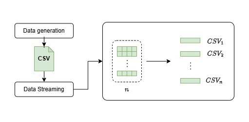

# Data Stream (Study)




Este projeto tem por objetivo treinar um pouco da parte de streaming de dados usando `node`. Para isso, foi utilizado um exemplo de fragmentar uma planilha de dados em formato `CSV`e fragmentada por linhas. Uma quantidade de linhas são armazenadas em um baffer até serem descarregadas em arquivos `CSV` menores.

## Tecnologias

Para este projeto, foram utilizadas as seguites tecnologias:

- `node`
- `typescript`
- `faker-js`
- `cli-progress`
- `vitest`

## Execussão do projeto

Antes de tudo, instale as dependências:

```
yarn
```

Depois gera a planilha de dados usando o comando:

```bash
yarn data
```

Ele deve gerar um arquivo de dados na raiz do projeto contendo alguns dados no formato do `faker-js`.

Caso deseje alterar a quantidade de linhas de dados geradas, você pode executar o comando `node build/fake-data.js --n=10000`. O parâmetro `n` indica a quantidade de linhas que deseja que tenha. Caso ele não seja passado, o default será 100.

Depois disso, execute:

```
yarn start
```

Esse comando irá gerar uma pasta `/out` contendo todos os arquivos `CSV` fragmentados em pacotes.
